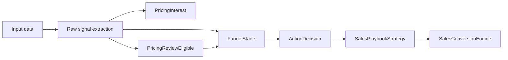

# Sales Playbook Refactor Plan

## Objective

Refactor the internal sales playbook architecture so that the following responsibilities are separated:

- `PricingInterest` detects whether a user is asking about price.
- `PricingReviewEligible` decides whether pricing discussion should occur.
- `FunnelStage` classifies the current conversation stage.
- `ActionDecision` selects `nextStep`, `cta`, and `pricingStrategy`.

This is a design-only refactor. No production heuristics, benchmark logic, or external API changes are planned in this cycle.

## Current architecture summary

The current implementation is centralized inside `engine/packages/conversation-orchestrator/src/sales-playbook-engine.ts`.

Key coupling points:

- `isPricingIntent` is used for both pricing gate logic and stage/action selection.
- `pricingReady` is used as the single signal for both Pricing stage classification and pricing flow gating.
- `readiness.stage` is used to select the final action branch, but it is derived from the same signals that also determine pricing eligibility.

## Proposed architecture

### 1. Signal extraction

Extract raw input signals from:

- `visitorIntent`
- `businessIntelligence`
- `websiteScanner`
- `knowledgeEngine`
- `conversationStage`

Produce a shared `RawSignals` object containing:

- `pricingInterest`
- `comparisonInterest`
- `buyingIntent`
- `bookingIntent`
- `supportIntent`
- `pageTypePricing`
- `hasPricingInfo`
- `atDecisionStage`
- `atConsideration`
- `atAwareness`
- `hasDemoPath`
- qualification/evidence signals

### 2. PricingInterest

Responsibility:

- Detect explicit pricing focus only.

Inputs:

- `visitorIntent.primaryIntent`

Outputs:

- `pricingInterest: boolean`

### 3. PricingReviewEligible

Responsibility:

- Decide whether pricing conversation should be eligible now.

Inputs:

- `pricingInterest`
- `comparisonInterest`
- `pageTypePricing`
- `hasPricingInfo`
- `atDecisionStage`
- `buyingIntent`
- supportive evidence signals

Outputs:

- `pricingReviewEligible: boolean`

### 4. FunnelStage

Responsibility:

- Classify the conversation into one of the funnel stages.

Inputs:

- raw signals
- `pricingReviewEligible`
- qualification signals
- stage-relevant signals

Outputs:

- `funnelStage: Awareness | Education | Qualification | Pricing | Sales`
- readiness booleans

### 5. ActionDecision

Responsibility:

- Select the final user-facing action(s).

Inputs:

- `funnelStage`
- `pricingReviewEligible`
- `contactSalesPreferred`
- `hasDemoPath`
- `qualificationNeeded`
- `industryTemplate`
- other raw contextual signals

Outputs:

- `nextStep`
- `cta`
- `pricingStrategy`
- `recommendationStrategy`
- rationale

## Data flow diagram

## Implementation approach

1. Keep `buildSalesPlaybook` as the public façade.
2. Introduce internal helpers with no exported API changes:
   - `extractSalesSignals()`
   - `evaluatePricingInterest()`
   - `evaluatePricingReviewEligibility()`
   - `classifyFunnelStage()`
   - `decideAction()`
3. Move existing logic into these helpers without changing predicates.
4. Preserve the shape of `SalesPlaybookStrategy` and all returned fields.
5. Keep `sales-conversion-engine.ts` unchanged.

## Regression test plan

New tests should prove:

- Changing `PricingInterest` alone does not automatically change `cta`.
- Changing `PricingInterest` alone does not automatically change `funnelStage` when explicit pricing eligibility is unchanged.
- `PricingReviewEligible` can be true while `FunnelStage` remains a non-pricing stage.
- `nextStep` and `cta` selection can be validated independently.

## API preservation

No changes will be made to:

- benchmark harnesses
- playbook output schema
- `SalesConversionEngine` interface
- benchmark reports

The internal refactor must be invisible to external consumers.
